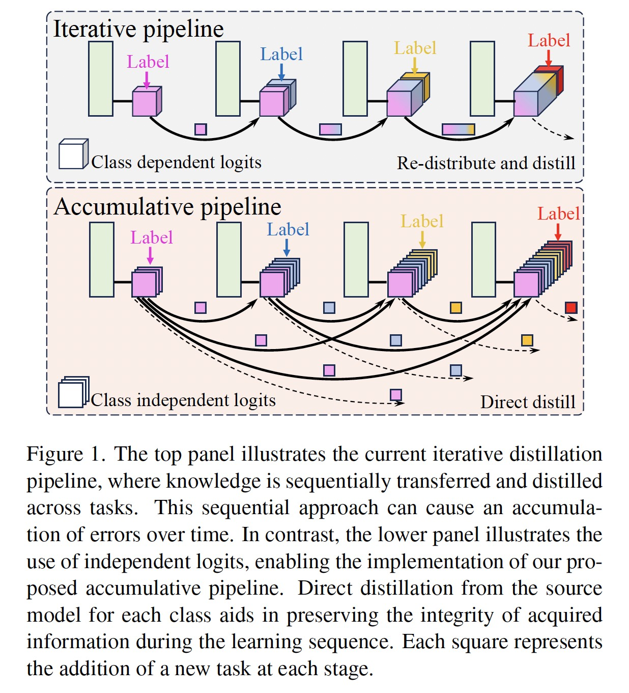
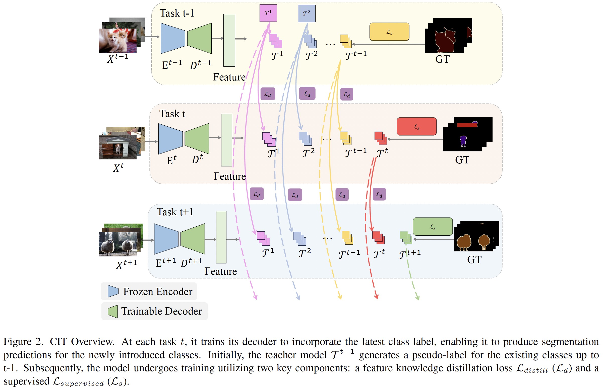

# CIT: Rethinking Class-incremental Semantic Segmentation with a Class Independent Transformation

[Jinchao Ge](https://github.com/jinchaogjc),[Bowen Zhang](https://www.linkedin.com/in/bowen-zhang-a7403095/), [Akide Liu](https://www.linkedin.com/in/akideliu/), [Minh Hieu Phan](https://scholar.google.com/citations?user=gSEw8EsAAAAJ&hl=en), [Qi Chen], [Yangyang Shu] [Yang Zhao](https://yangyangkiki.github.io/)*

*Corresponding author: y.zhao2@latrobe.edu.au 

[[**Paper Link**]](https://arxiv.org/abs/2411.02715) [[Papers with Code]]()

## Abstract
Class-incremental semantic segmentation (CSS) requires that a model learn to segment new classes without forgetting how to segment previous ones: this is typically achieved by distilling the current knowledge and incorporating the latest data. However, bypassing iterative distillation by directly transferring outputs of initial classes to the current learning task is not supported in existing class-specific CSS methods. Via Softmax, they enforce dependency between classes and adjust the output distribution at each learning step, resulting in a large probability distribution gap between initial and current tasks. We introduce a simple, yet effective Class Independent Transformation (CIT) that converts the outputs of existing semantic segmentation models into class-independent forms with negligible cost or performance loss. By utilizing class-independent predictions facilitated by CIT, we establish an accumulative distillation framework, ensuring equitable incorporation of all class information. We conduct extensive experiments on various segmentation architectures, including DeepLabV3, Mask2Former, and SegViTv2. Results from these experiments show minimal task forgetting across different datasets, with less than 5% for ADE20K in the most challenging 11 task configurations and less than 1% across all configurations for the PASCAL VOC 2012 dataset.






## Citation

For academic use, please cite:
```
@article{ge2024cit,
  title={CIT: Rethinking Class-incremental Semantic Segmentation with a Class Independent Transformation},
  author={Ge, Jinchao and Zhang, Bowen and Liu, Akide and Phan, Minh Hieu and Chen, Qi and Shu, Yangyang and Zhao, Yang},
  journal={arXiv preprint arXiv:2411.02715},
  year={2024}
}
```
